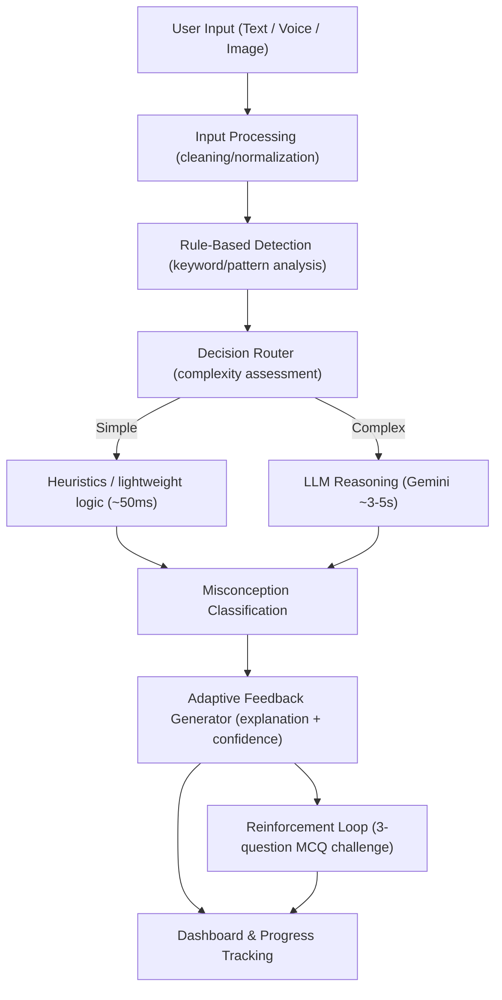

# AMCE Analyzer

**AI-powered misconception detection & feedback system (multi-modal: text, voice, image).**

AMCE Analyzer helps identify, classify, and respond to student misconceptions. It uses a cost-aware pipeline: fast rule-based checks first, and an LLM (Google Gemini) only when deeper reasoning is needed.

---

## Key Features

- **Multi-modal input**: text, voice (browser Web Speech API in English), and image upload (OCR placeholder).
- **Misconception classification**: Conceptual, Procedural, Overgeneralization, Partial.
- **Adaptive feedback**: explanation + follow-up guidance with confidence scoring.
- **Reinforcement mode**: optional 3-question MCQ challenge after an incorrect answer.
- **Dashboard**: attempt history, accuracy, weak areas, quiz progress.

---

## Tech Stack

- **Frontend**: React 18, Vite 5.4, Tailwind CSS
- **Backend**: Node.js, Express.js
- **AI layer**: Google Gemini API (model configurable via `.env`)

---

## Architecture (High-Level)



---

## Project Structure

```text
AMCE/
├── backend/
│   ├── app.js
│   ├── controllers/
│   │   └── analysisController.js
│   ├── routes/
│   │   ├── analysisRoutes.js
│   │   └── ocrRoutes.js
│   └── services/
│       ├── decision/router.js
│       ├── feedback/feedbackService.js
│       ├── llm/geminiService.js
│       ├── preprocessing/
│       ├── quiz/quizService.js
│       ├── reinforcement/reinforcementService.js
│       └── rules/ruleEngine.js
└── frontend/
    ├── src/
    │   ├── App.jsx
    │   ├── components/
    │   │   ├── Dashboard.jsx
    │   │   ├── InputBox.jsx
    │   │   ├── VoiceInput.jsx
    │   │   └── UploadSection.jsx
    │   ├── services/api.js
    │   └── utils/
    └── vite.config.js
```

---

## Quickstart

Use the dedicated guide: **[QUICKSTART.md](QUICKSTART.md)**

---

## Configuration

### Backend (`backend/.env`)

Create a `.env` file inside `backend/`:

```env
GEMINI_API_KEY=your_api_key_here
GEMINI_MODEL=gemini-2.5-flash
PORT=5000
```

### Frontend (optional)

If your frontend needs to override the API URL, set:

```env
VITE_API_URL=http://localhost:5000/api
```

---

## Contributing

Contributions are welcome. Ideas:

- Improve rule-engine coverage for misconception patterns
- Make OCR real (e.g., Tesseract.js) if currently mocked/simulated
- Improve quiz difficulty adaptation and persistence
- Add teacher/classroom dashboard features
- Pronunciation feedback using Web Audio API

---

## License

MIT License - see `LICENSE` file for details.
