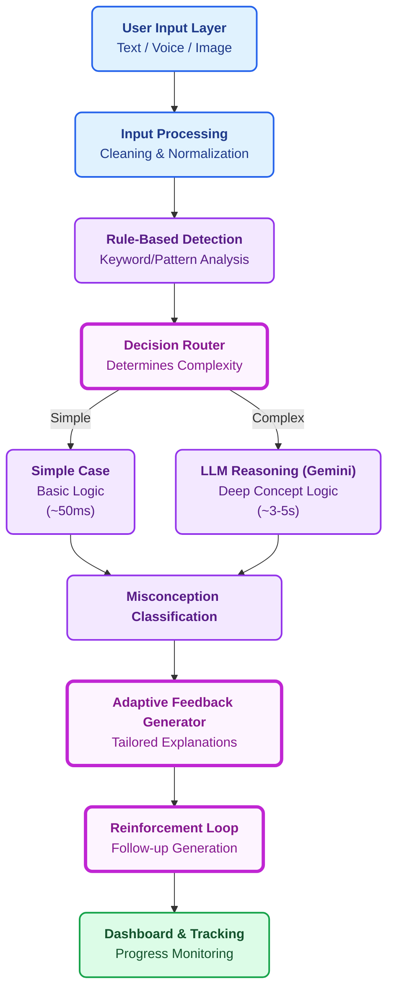

# 🧠 AMCE Analyzer 
**AI-Powered Misconception Detection System**

The AMCE Analyzer is an advanced educational ecosystem built to detect, classify, and instantly correct student misconceptions using multi-modal AI inputs. It combines intelligent **Clean Architecture** with an interactive learning reinforcement system, featuring **multi-language voice input**, AI-powered feedback, and interactive 3-question challenge quizzes.

---

## âš¡ Tech Stack

- **Frontend:** React 18, Vite 5.4, Tailwind CSS (Dark Mode UI with Micro-animations)
- **Backend:** Node.js, Express.js (Modular Service-Based Architecture)
- **AI Layer:** Google Gemini 2.5 Flash API (Structured JSON Inference)
- **Input Modalities:** 
  - Text input (typing)
  - Voice input (Web Speech API with 3-language support: English, Hindi, Marathi)
  - Image upload (OCR placeholder)

---

## 🏗️ Architecture Pipeline

The system intelligently routes requests through modular services:



---

## 🎯 Features & Workflow

### 🎤 **Multi-Modal Inputs**
- **Text Input**: Type questions and answers directly
- **Voice Input**: Speak in 3 languages (English, Hindi, Marathi); real-time transcription display
- **UI Language**: Change interface language to English, Hindi, or Marathi
- **Image Upload**: Upload document scans or diagrams (OCR-based text extraction)

### âš¡ **Intelligent Processing**
- Rule engine optimization: "Simple" statements trigger rapid pattern matching
- Dynamic routing based on complexity assessment
- Multi-model fallback for robustness

### 🧠 **AI Classification**
- Gemini classifies logical gaps into educational categories:
  - **Conceptual**: Misunderstands fundamental concept
  - **Procedural**: Wrong method or process
  - **Overgeneralization**: Applies rule too broadly
  - **Partial**: Incomplete understanding

### 🎯 **Targeted Feedback**
- Context-specific explanations tailored to error type
- Confidence scoring for each analysis
- Processing method transparency (rule-based vs. AI)

### 🔁 **Interactive Reinforcement**
- **3-Question Challenge Quiz**: AI-generated MCQ quiz targeting the detected misconception
- **Per-question feedback**: Real-time correctness verification
- **Progress tracking**: Quiz attempts, accuracy %, misconceptions improved

### 📊 **Dashboard & Analytics**
- Real-time progress metrics
- Weak area identification
- Attempt history with timestamps
- Separate quiz progress section
- Misconception improvement counter

---

## 📂 Project Structure

```
AMCE/
├── backend/
│   ├── app.js (Express server)
│   ├── package.json
│   ├── controllers/
│   │   └── analysisController.js (HTTP handlers, language parameter extraction)
│   ├── routes/
│   │   ├── analysisRoutes.js (POST /api/analyze, /api/challenge/*)
│   │   └── ocrRoutes.js
│   └── services/
│       ├── decision/router.js (Complexity routing)
│       ├── feedback/feedbackService.js (Personalize responses)
│       ├── llm/geminiService.js (Gemini API integration, language-aware prompts)
│       ├── preprocessing/
│       │   ├── ocrService.js
│       │   └── textCleaner.js
│       ├── quiz/quizService.js (3-question session management)
│       ├── reinforcement/reinforcementService.js (Follow-up generation)
│       └── rules/ruleEngine.js (Pattern detection)
│
├── frontend/
│   ├── package.json
│   ├── vite.config.js
│   ├── tailwind.config.js
│   ├── src/
│   │   ├── main.jsx
│   │   ├── App.jsx (State mgmt, dual history)
│   │   ├── index.css (Tailwind imports)
│   │   ├── components/
│   │   │   ├── Dashboard.jsx (Metrics, quiz progress section)
│   │   │   ├── InputBox.jsx (Language selector, dual VoiceInput)
│   │   │   ├── VoiceInput.jsx (Multi-language speech recognition)
│   │   │   └── UploadSection.jsx (Image upload)
│   │   ├── services/
│   │   │   └── api.js (REST client with port discovery)
│   │   └── utils/
│   │       └── languages.js (Language codes, mappings)
│   └── dist/ (Production build)
│
└── README.md (This file)
```

---

## 🚀 Quick Start

### Prerequisites
- Node.js 16+
- npm or yarn
- Google Gemini API key (free tier available)

### Backend Setup
```bash
cd backend
npm install
echo GEMINI_API_KEY=your-api-key-here > .env
echo GEMINI_MODEL=gemini-2.5-flash >> .env
npm start
```
Backend runs on `http://localhost:5000` (or auto-discovers available port 5001-5005)

### Frontend Setup
```bash
cd frontend
npm install
npm run dev
```
Frontend runs on `http://localhost:5173` (or next available)

---

## 🎮 Usage Flow

1. **Select Voice Language**: Choose from 3 languages (English, Hindi, Marathi) for voice input
2. **Select UI Language** (Optional): Change interface language to English, हिन्दी, or मराठी

3. **Input Question**: Type or speak your question
3. **Input Answer**: Type, speak, or upload image with your answer
4. **Analyze**: Click "âš¡ Analyze" button
5. **Review Feedback**: See misconception type, explanation, and confidence score
6. **Try Challenge** (if incorrect): Start 3-question MCQ quiz to reinforce learning
7. **Track Progress**: View dashboard metrics in real-time

---

## 🧪 Testing

### Test with Voice Input
1. Run both servers (backend on 5002, frontend on 5174)
2. Click "🎤 Speak (Answer)" button
3. Allow microphone permission when prompted
4. Speak your answer clearly
5. Watch real-time transcript appear
6. Click "âš¡ Analyze"

### Test Multi-Language
1. Change language dropdown (e.g., to Spanish 🇪🇸)
2. Click "🎤 Speak (Answer)"
3. Speak in Spanish
4. Backend receives language parameter and Gemini analyzes with language context

### Test Quiz Mode
1. Submit an incorrect answer
2. Click "→ Start 3-Question Challenge"
3. Answer 3 AI-generated MCQ questions
4. Track score and misconception improvement on dashboard

---

## 🔧 Configuration

### Backend (.env)
```
GEMINI_API_KEY=your-api-key
GEMINI_MODEL=gemini-2.5-flash
PORT=5000
```

### Frontend (.env optional)
```
VITE_API_URL=http://localhost:5000/api
```

---

## 🤝 Contributing

Contributions are welcome! Areas for enhancement:
- [ ] Quiz difficulty adaptive scaling
- [ ] Teacher dashboard for class monitoring
- [ ] Persistent quiz bank (currently session-based)
- [ ] Multi-language rule engine patterns
- [ ] Pronunciation feedback using Web Audio API
- [ ] Speech synthesis (read questions aloud)

---

## 📜 License

MIT License - See LICENSE file for details

---

## 🎓 Educational Impact

AMCE Analyzer helps students:
- **Identify** their specific misconceptions in real-time
- **Understand** why their answer was incorrect with AI-powered explanations
- **Reinforce** learning through interactive challenge quizzes
- **Track** progress and weakest concept areas
- **Learn** in their preferred language with voice input

Built for educators and learners worldwide. 🌍

---

## 🚀 Getting Started

This repository contains both the **Frontend** and **Backend** code. You will need to run them concurrently in two separate terminal windows.

### 1. Backend Setup (Node.js)
The backend manages the pipeline, the router, and controls communication with Google Gemini.

```bash
# Navigate to the backend folder
cd backend

# Install dependencies
npm install

# Setup Environment Variable
# You must provide your Gemini API key in a `.env` file located in the /backend folder
# Example: Create .env and add -> GEMINI_API_KEY=AIzaSy...

# Start the development server (runs on port 5000)
npm run dev
```

### 2. Frontend Setup (React/Vite)
The frontend uses Tailwind CSS for premium, fast, dark-mode styling.

```bash
# Navigate to the frontend folder
cd frontend

# Install dependencies
npm install

# Start the frontend dev server
npm run dev
```

Finally, open your browser and go to `http://localhost:5173` to view the application!

---

## 🏗️ Project Structure

The project has been configured following strict separation of concerns:

```text
amce-project/
│
├── frontend/                      
│   ├── src/
│   │   ├── components/           # UI logic (InputBox, VoiceInput, Dashboard, UploadSection)
│   │   ├── services/             # Axios API link to Backend
│   │   └── App.jsx
│
├── backend/                      
│   ├── controllers/              # Core Orchestration (analysisController)
│   ├── routes/                   # API Endpoints
│   ├── services/                 # Business Logic modules
│   │   ├── preprocessing/        # Text Cleaners & OCR Mock
│   │   ├── rules/                # Fast Rule-Based Engine
│   │   ├── decision/             # Router
│   │   ├── llm/                  # Gemini AI Integration
│   │   ├── feedback/             # Feedback Generator
│   │   └── reinforcement/        # Reinforcement Loop
│   ├── .env                      # API Credentials file (DO NOT COMMIT)
│   └── app.js                    # Main Express Application
```

