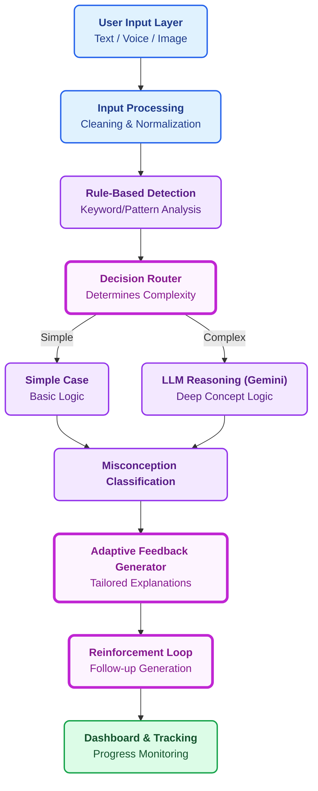

# 🧠 AMCE Analyzer 
**AI-Powered Misconception Detection System**

The AMCE Analyzer is an advanced educational ecosystem built to detect, classify, and instantly correct student misconceptions using multi-modal AI inputs. Rather than passing all traffic through expensive LLMs, AMCE relies on an intelligent **Clean Architecture pipeline**—routing inputs through rule engines first, deciding on context complexity, and using Google Gemini AI for deep reasoning only when necessary.

---

## ⚡ Tech Stack

- **Frontend:** React.js, Vite, Tailwind CSS (Sleek UI with Dark Mode + Micro-animations)
- **Backend:** Node.js, Express.js (Modular Service-Based Architecture)
- **AI Layer:** Google Gemini 2.5 Flash API (Structured JSON Inference)
- **Input Modalities:** Text, Voice (Web Speech API), Image Upload (OCR Placeholder)

---

## 🏗️ Architecture Pipeline

The system is built on a highly modular pipeline that optimizes speed and AI costs:



---

## 🎯 Features & Workflow

- 🎤 **Multi-Modal Inputs:** Speak your answers directly into the browser, upload images (scans), or type questions manually.
- ⚡ **Rule Engine Optimization:** "Simple" statements (e.g. ones that clearly say "always" or "all") trigger rapid partial-detection filters before engaging the LLM.
- 🧠 **AI Classification:** Gemini classifies logical gaps into distinct educational buckets (`Overgeneralization`, `Procedural`, `Conceptual`, `Partial`).
- 🎯 **Targeted Feedback:** Generates an analogy or direct correction tailored exactly to the classified error.
- 🔁 **Reinforcement Learning:** Immediately quizzes the student with a contextual follow-up question.
- 📊 **Dashboard:** Real-time logging of session history and misconception tags to track learning progress over time.

---

## 🚀 Getting Started

This repository contains both the **Frontend** and **Backend** code. You will need to run them concurrently in two separate terminal windows.

### 1. Backend Setup (Node.js)
The backend manages the pipeline, the router, and controls communication with Google Gemini.

```bash
# Navigate to the backend folder
cd backend

# Install dependencies
npm install

# Setup Environment Variable
# You must provide your Gemini API key in a `.env` file located in the /backend folder
# Example: Create .env and add -> GEMINI_API_KEY=AIzaSy...

# Start the development server (runs on port 5000)
npm run dev
```

### 2. Frontend Setup (React/Vite)
The frontend uses Tailwind CSS for premium, fast, dark-mode styling.

```bash
# Navigate to the frontend folder
cd frontend

# Install dependencies
npm install

# Start the frontend dev server
npm run dev
```

Finally, open your browser and go to `http://localhost:5173` to view the application!

---

## 🏗️ Project Structure

The project has been configured following strict separation of concerns:

```text
amce-project/
│
├── frontend/                      
│   ├── src/
│   │   ├── components/           # UI logic (InputBox, VoiceInput, Dashboard, UploadSection)
│   │   ├── services/             # Axios API link to Backend
│   │   └── App.jsx
│
├── backend/                      
│   ├── controllers/              # Core Orchestration (analysisController)
│   ├── routes/                   # API Endpoints
│   ├── services/                 # Business Logic modules
│   │   ├── preprocessing/        # Text Cleaners & OCR Mock
│   │   ├── rules/                # Fast Rule-Based Engine
│   │   ├── decision/             # Router
│   │   ├── llm/                  # Gemini AI Integration
│   │   ├── feedback/             # Feedback Generator
│   │   └── reinforcement/        # Reinforcement Loop
│   ├── .env                      # API Credentials file (DO NOT COMMIT)
│   └── app.js                    # Main Express Application
```
